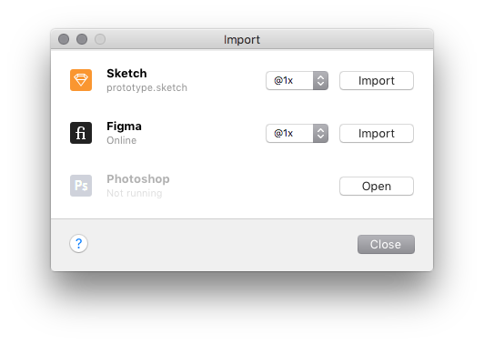

# react-prototyping
Skeleton repository to get started with prototyping applications with React, Sketch + FramerJS

## Requirements

 - Node
 - [Sketch](https://www.sketchapp.com)
 - [Framer Generator](https://builds.framerjs.com/latest/Framer.zip)

## Getting started

 1. Open file `prototype.sketch` in Sketch
 1. Open Framer Generator and import the layers from Sketch
 1. Run `npm install`
 1. Edit `app.coffee`
 1. Run `npm run dev` to view thw prototype

Changes to `app.js` cause the prototype to reload. After changing the Sketch file, re-run the import from Generator and reload the web browser.

 
## Deployment

In order to show the prototype to others, run `npm run dist` and publish the contents of the `prototype.framer` folder to a web server.
